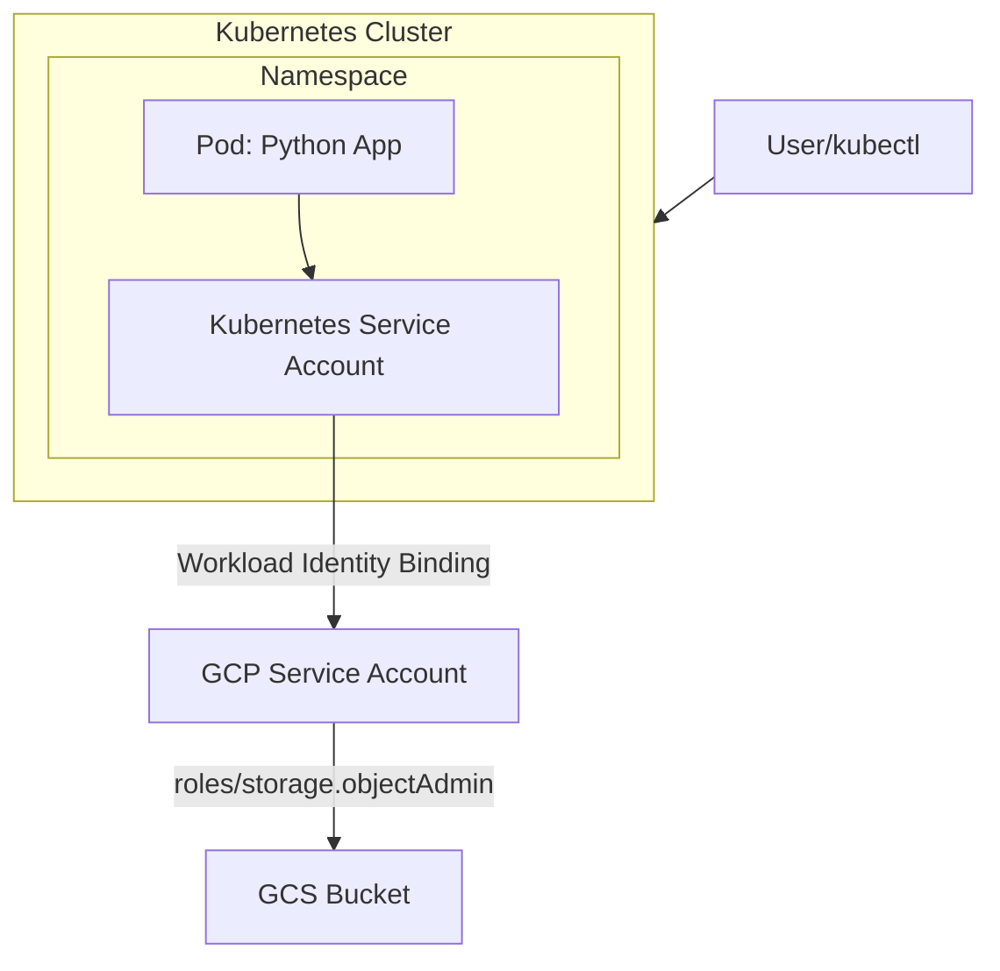

# GKE + Google Cloud Storage Integration 

## Project Overview

The application is deployed on a Kubernetes cluster and accesses a GCS bucket to upload a dummy file. Authentication is handled securely without service account keys using GKE Workload Identity.

---

## Architecture



---

## Tech Stack

- Kubernetes (GKE)
- Docker
- Python
- Google Cloud Shell 
- Google Cloud Storage
- Google Artiact Registry
- IAM & Workload Identity


---

## Key Features

- Secure authentication using Workload Identity (no static credentials)
- Integration with GCS 
- Containerized Python application


---

## Setup & Deployment

### 1. Prerequisites

- GCP account
- Enabled APIs:
  - Kubernetes Engine API
  - Cloud Storage API
  - Artifact Registry API 
- IAM Roles
  - roles/container.admin → create/manage GKE
  - roles/storage.admin → create bucket
  - roles/iam.serviceAccountAdmin → create service accounts
  - roles/iam.serviceAccountUser → bind identitiy
  - roles/artifactregistry.admin → create/manage AR repo 

---

### 2. Configure GCP

Authorize cloud shell

---

### 3. Create GCS Bucket

This is the bucket where the dummy file will be uploded once the application is deployed.


```bash
gsutil mb -l asia-south1 gs://gcs-gke

```

---

### 4. Create and connect to GKE Cluster

📌 In GKE stadard clusters, Workload Identity has to be enabled unlike autopilot clusters where it's enabled by default.

```bash
#Create the cluster
gcloud container clusters create cluster-1 \
  --zone asia-south1-a \
  --num-nodes=2 \
  --workload-pool=PROJECT_ID.svc.id.goog #enable workload identity on the cluster

#Connect to the cluster
gcloud container clusters get-credentials cluster-1 --zone asia-south1-a
```

---

### 5. Create namespace

This is where the application and its relevant resources will be deployed, logically separated from other k8s resoures. 

```bash
# Clone the git repo in cloud shell
git clone https://github.com/SreyasiB/gke-gcs-integration.git

# Create namespace
cd k8s-manifests/
kubectl apply -f namespace.yml
```

---

### 6. Configure Workload Identity

#### Create GCP Service Account

```bash
gcloud iam service-accounts create gsa-gke-gcs
```

#### Grant Storage Access

```bash
gcloud projects add-iam-policy-binding PROJECT_ID \
  --member="serviceAccount:gsa-gke-gcs@PROJECT_ID.iam.gserviceaccount.com" \
  --role="roles/storage.objectAdmin"
```

#### Create Kubernetes Service Account

```bash
kubectl create serviceaccount ksa-gke-gcs-demo --namespace gcs-uploader
```

#### Bind KSA to GSA

```bash
gcloud iam service-accounts add-iam-policy-binding \
  gsa-gke-gcs@YOUR_PROJECT_ID.iam.gserviceaccount.com \
  --member="serviceAccount:YOUR_PROJECT_ID.svc.id.goog[gcs-uploader/ksa-gke-gcs-demo]" \
  --role="roles/iam.workloadIdentityUser"
```

#### Annotate KSA

```bash
kubectl annotate serviceaccount \
--namespace gcs-uploder ksa-gke-gcs-demo \
 iam.gke.io/gcp-service-account=gsa-gke-gcs@PROJECT_ID.iam.gserviceaccount.com
```

---

### 7. Build & Push Docker Image to Google Artifact Registry

#### Create the Repository

```bash
gcloud artifacts repositories create demo-repo \
    --repository-format=docker \
    --location=asia-south1 
```

#### Build the image locally in cloud shell

```bash
cd app/
docker build -t gcs-uploader .
```

#### Configure Docker Authentication

```bash
gcloud auth configure-docker asia-south1-docker.pkg.dev
```

#### Tag and Push the Image to the repo

```bash
# Tag the image
docker tag gcs-uploader asia-south1-docker.pkg.dev/[PROJECT-ID]/demo-repo/gcs-uploader:v1

# Push the image
docker push asia-south1-docker.pkg.dev/[PROJECT-ID]/demo-repo/gcs-uploader:v1

```

---

### 8. Deploy to Kubernetes

```bash
cd k8s-manifests/
kubectl apply -f deployment.yml
```

---

## Verification

#### Check pod status:

```bash
kubectl get pods -n gcs-uploader
```

#### View logs:

```bash
kubectl logs <pod-name> -n gcs-uploader
```

#### Expected output:

```
Uploading hello_gke.txt to bucket gcs-gke...
Upload successful!
```

---

## Learning Outcomes

- Deploy applications on Kubernetes (GKE)
- Configure secure access to GCP services using IAM
- Implement Workload Identity
- Build and push Docker images
- Debug and verify Kubernetes workloads
